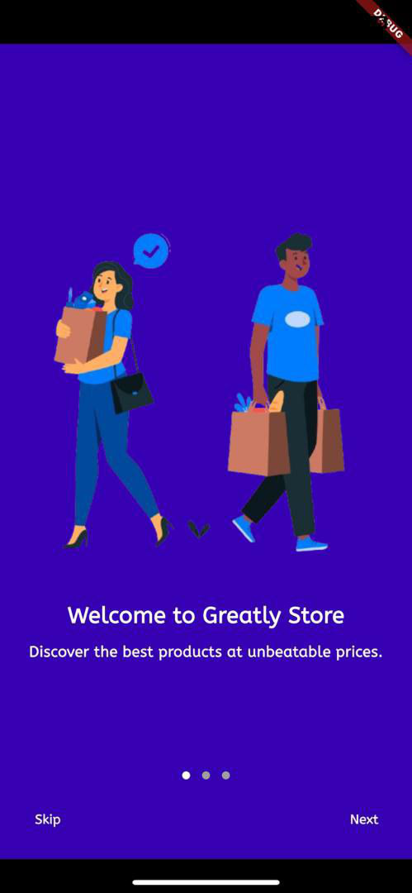
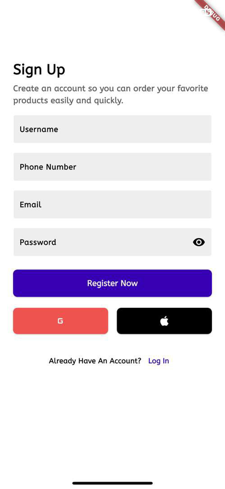
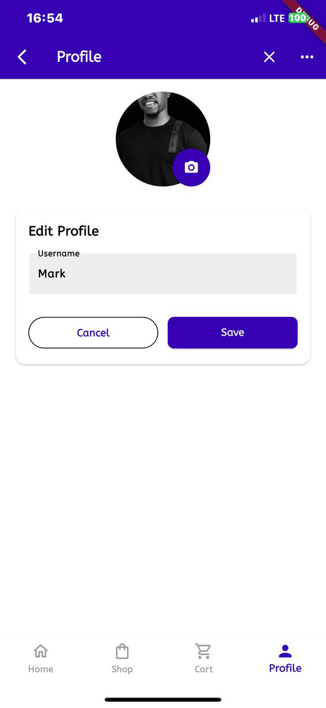

# GREATLY – E-COMMERCE APP

Greatly is a modern e-commerce app built with Flutter for Android and iOS. It features Firebase authentication, Stripe payments, and a Strapi backend. Initially deployed on Railway, the backend was later migrated to Render, demonstrating real-world deployment experience and platform flexibility. The app follows Clean Architecture with Bloc for scalable, maintainable code.

## 📱 DOWNLOAD APP
<a href="https://github.com/DevGR8T/Greatly-App-With-Clean-Architecture/releases/latest/download/greatly_app.apk">

</a>

## 📱 DEMO VIDEO
You can see a Demo video [Here](https://youtube.com/shorts/iP59xr_yL-s?feature=share)

## Screenshots

| Splash Screen | onBoarding 1 | onBoarding 2 | onBoarding 3 |
|:-:|:-:|:-:|:-:|
|  |  |  |  |

| Register Screen | Login Screen | Forgot Password Screen | Home Screen |
|:-:|:-:|:-:|:-:|
|  |  |  |  |

| Shop Page | Product Details | Review | Search |
|:-:|:-:|:-:|:-:|
|  |  | |  | 

| Filter | Cart Page | Address | Payment Methods |
|:-:|:-:|:-:|:-:|
|  |  |  |  | 

| Checkout Page | Order Confirmation | Profile Page | Settings |
|:-:|:-:|:-:|:-:|
||  |  |  |


### SYSTEM REQUIREMENTS
- **Android**: Android 5.0 (API level 21) or higher
- **iOS**: iOS 12.0 or later
- **Internet**: Required for full functionality

### INSTALLATION INSTRUCTIONS

#### Android APK Installation
1. Download the APK file from the link above
2. Enable "Install from Unknown Sources" in your device settings
3. Open the downloaded APK file and follow the installation prompts
4. Launch the app and enjoy shopping!


---

## 🚀 APP FEATURES

• Login and Register with Firebase (Email, Google, Apple)  
• Email verification and password reset built-in  
• Smart session handling so users stay logged in  
• Stripe payments with saved cards and address management  
• Browse, search, and filter products by category  
• Beautiful product pages with ratings, reviews, and banners  
• Add, update, and remove items in the cart (works offline too)  
• Track orders and view full order history  
• Create and update user profile with profile picture support  
• Easy logout and session cleanup  
• Leave reviews, view others, and check average ratings  
• Only users who bought the product can leave reviews  
• Firebase push notifications with full notification center  
• Smooth and beautiful onboarding with local storage tracking  
• Clean state management using Bloc pattern  
• Built with Clean Architecture (Presentation, Domain, Data)  
• Uses service locator for easy dependency injection  
• Strapi CMS with PostgreSQL — initially deployed on Railway, now hosted on Render 
• API calls handled with Dio and REST integration  
• Works perfectly on both Android and iOS  
• Light and Dark Mode support with adaptive themes  
• Reusable UI widgets, custom text styles, shimmer loaders  
• Supports multiple environments (Dev, Staging, Prod)  
• Interceptors for auth tokens and error handling  
• Form validation and user feedback via snackbars  


## 📂 PROJECT STRUCTURE

```
lib/
├── app.dart                                    # App initialization
├── bootstrap.dart                              # Bootstrap configuration
├── core/                                       # Core utilities and configurations
│   ├── config/                                 # Environment and routing configs
│   │   ├── env/                                # Environment-specific configs
│   │   │   ├── dev_config.dart
│   │   │   ├── prod_config.dart
│   │   │   ├── staging_config.dart
│   │   │   └── env_config.dart
│   │   └── routes/
│   │       └── routes.dart                     # App routing
│   ├── constants/                              # App-wide constants
│   │   ├── auth_strings.dart
│   │   ├── error_messages.dart
│   │   ├── strings.dart
│   │   └── validation_strings.dart
│   ├── di/                                     # Dependency Injection
│   │   ├── service_locator.dart
│   │   └── service_locator.config.dart
│   ├── error/                                  # Error handling
│   │   ├── exceptions.dart
│   │   └── failure.dart
│   ├── network/                                # Network-related utilities
│   │   ├── api_client.dart
│   │   ├── dio_client.dart
│   │   ├── interceptors/
│   │   │   ├── auth_interceptor.dart
│   │   │   ├── error_interceptor.dart
│   │   │   └── logging_interceptor.dart
│   │   ├── network_info.dart
│   │   ├── network_info_impl.dart
│   │   └── protected_api_service.dart
│   ├── theme/                                  # UI theming
│   │   ├── app_colors.dart
│   │   ├── app_text_styles.dart
│   │   ├── app_text_theme.dart
│   │   └── app_theme.dart
│   ├── usecases/
│   │   └── usecase.dart                        # Base usecase class
│   └── utils/                                  # Utility functions and mixins
│       ├── error_utils.dart
│       ├── json_helper.dart
│       ├── mediaquery.dart
│       └── mixins/
│           ├── form_validation_mixin.dart
│           └── snackbar_mixin.dart
├── features/                                   # Feature modules
│   ├── auth/                                   # Authentication feature
│   │   ├── data/                               # Data layer (datasources, repositories)
│   │   ├── domain/                             # Domain layer (entities, usecases)
│   │   └── presentation/                       # UI layer (pages, widgets, bloc)
│   ├── cart/                                   # Shopping cart feature
│   │   ├── data/
│   │   ├── domain/
│   │   └── presentation/
│   ├── checkout/                               # Checkout and payment feature
│   │   ├── data/
│   │   ├── domain/
│   │   └── presentation/
│   ├── home/                                   # Home page feature
│   │   ├── data/
│   │   ├── domain/
│   │   └── presentation/
│   ├── main/                                   # Main navigation feature
│   │   └── presentation/
│   ├── notifications/                          # Push notifications feature
│   │   └── data/
│   ├── onboarding/                             # Onboarding feature
│   │   ├── data/
│   │   ├── domain/
│   │   └── presentation/
│   ├── products/                               # Product browsing feature
│   │   ├── data/
│   │   ├── domain/
│   │   └── presentation/
│   ├── profile/                                # User profile feature
│   │   ├── data/
│   │   ├── domain/
│   │   └── presentation/
│   └── reviews/                                # Product reviews feature
│       ├── data/
│       ├── domain/
│       └── presentation/
├── firebase_options.dart                       # Firebase configuration
├── services/                                   # App services
│   └── notification_manager.dart
└── shared/                                     # Shared components and widgets
    ├── components/                             # Reusable UI components
    │   ├── app_shimmer.dart
    │   └── error_state.dart
    ├── dialogs/                                # Custom dialogs
    │   ├── email_not_verified_dialog.dart
    │   └── email_verification_dialog.dart
    └── widgets/
        └── custom_text_field.dart
```

## 🔧 DEVELOPMENT SETUP

### Prerequisites
- Flutter SDK (latest stable version)
- Dart SDK
- Android Studio / VS Code
- Firebase account and project setup
- Stripe account for payment processing

### Getting Started
1. Clone the repository
2. Install dependencies: `flutter pub get`
3. Set up Firebase configuration
4. Configure Stripe keys in environment files
5. Run the app: `flutter run`

